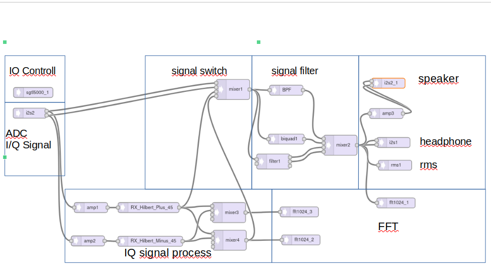
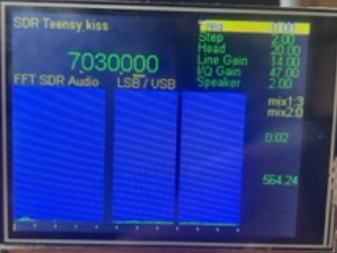
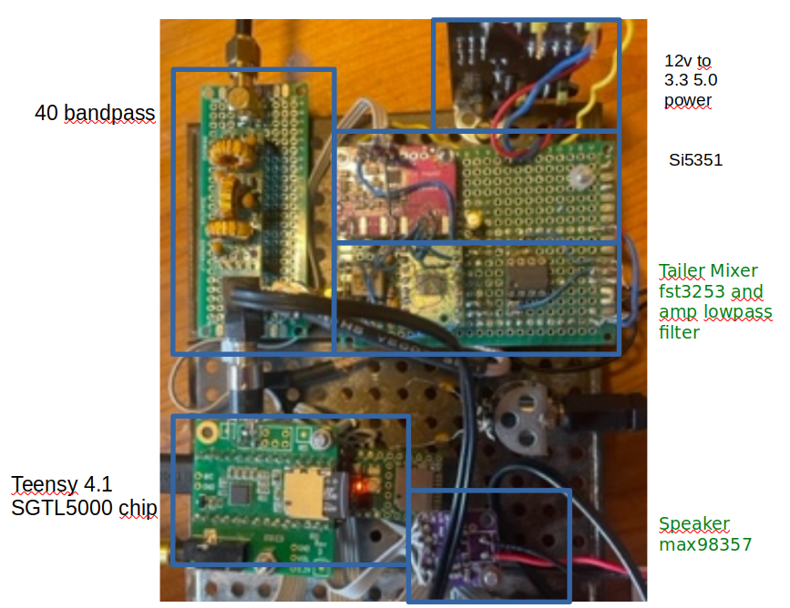

# SDR kiss "keep it simpel"  

+ VERSION = "1.0  1.3.24" 
### Goal
The construction and programming of the SDR receiver was a learning exercise for me. 
My question was: Have I understood the fundamentals of SDR and can I build an SDR with 
a modular approach? The answer is yes! Thanks to the numerous articles and forums available 
for delving deeper into the subject, and on GitHub, one can also find code that can be
incorporated into their own code by copying, adjusting slightly, and pasting. 
In the end, it works.

### Thanks 
At this point, many thanks to Frank dd4wh and Paul Stoffregen. I have learned a lot from you both. 
And of course, many others as well. 

73 from Uli **dl2dbg** 

### Programming in this case, is simpel
The programming of the Software Defined Radio (SDR) is accomplished by utilizing the existing DSP software library 
for the Teensy 4.1.

The Teensy Audio Library is a versatile toolkit designed for creating streaming audio projects.
It is comparable to GNU Radio Companion. https://www.pjrc.com/teensy/td_libs_Audio.html

## SDR  block diagram





## The function of Software Defined Radio (SDR) involves several blocks:

### i2s2 
ADC (Analog-to-Digital Conversion) of the Signal into IQ Signals: The incoming analog signal is sampled and converted 
into digital form. 

### Amp1,2
With the two amplifiers, the IQ signal is adjusted to the same amplitude. The balance adjustment is used to set the **sideband suppression**.

### RX_Hilbert_Plus,Minus 45
A Hilbert filter is commonly used to generate a phase-shifted version of the original signal, In this case, a phase delay of
**plus** and **minus** 45 degrees of the IQ signal is applied to generate the sidebands USB (Upper Sideband) and LSB (Lower Sideband).

### Mixer3,4 
Adding the Signal as Upper Sideband (USB) and Lower Sideband (LSB)

### fft1024_3 ,2
Compute a 1024 point Fast Fourier Transform (FFT) frequency analysis, with real value (magnitude) output. The frequency resolution is 43 Hz, 
useful detailed for audio visualization and show USB (Upper Sideband) und LSB (Lower Sideband)

#### USB 
FFT `show_spectrum2' show USB (Upper Sideband)  
A simple implementation, the FFT data will be read backwards, those are the mirrored frequencies.

`code read backwards -> read(70-i*1,70-i) `

### Mixer1 
With the mixer1, you can switch between different signal outputs in the signal chain from the AD converter, the Hilbert filter, and the USB signal. 
The mixer helps with controlling the signal and aids in understanding the SDR function.

### BFT
BFT is a finite impulse response filter for 700 Hz calculated, using the tool http://t-filter.engineerjs.com/."

### filter1
A State Variable (Chamberlin) Filter with 12 dB/octave roll-off, adjustable resonance, and optional signal control of corner frequency.

### Biquadratic
Biquadratic cascaded filter.

`biquad1.setBandpass(0,  freqf, 0.54);`

### Mixer2  
With the mixer, you can switch between the output of different filters.

### i2s2_1
The interface is connected as I2S signals to the MAX98357, which is a speaker amplifier.

### amp3
The volume of the speaker is adjusted by the gain of the AMP3 amplifier.

### i2s_1
Is the interface for the Headphone Device STGL5000."

### rms1
With RMS, the signal strength can be measured. The range of values is 0-1.0.

### fft1024_1
Compute a 1024 point Fast Fourier Transform (FFT) frequency analysis, with real value (magnitude) output. The SDR output signal of the entire signal chain. 
 

### A brief list of C functions"
From the function names, one can usually also derive the function.
```
cat sdr_kiss.ino | grep //void

void setup_SI5351() {
void set_vfo_si5351(signed long long freq) {

void show_scale(void) {
void show_spectrum(void) {
void show_spectrum2(void) {
void show_spectrum3(void) {

void TFT_Print_headline(String txt) {
void TFT_Print_menue_a(String txt, int i) {
void TFT_Print_menue_b(String txt, int i) {
void TFT_Print_headline_spectrum(String txt) {
void TFT_Print_txt(int v, const char* txt, int clour) {
void TFT_Print_value(int v, float wert, int clour) {
void Print_value() {
void TFT_Print_value_freq(float wert, int step) {

void setMixer1Gain(int input) {  //Depending on the input, the mixer.gain will be set to 1.0 and the others to 0.0.
void setMixer2Gain(int input) {

void setup() {
void loop() {
```

### hardware PINs
All utilized hardware PINs of the Teensy are marked with comments //PIN.
An overview can easily be created using GEP.
```
cat sdr_kiss.ino | grep //PIN

//PIN encoder
//PIN max98357 speaker amplifier
//PIN TFT Touchscreen Definition of Teensy hardware pin.
//PIN Audio Shield Definition of Teensy hardware pin.
  //PIN encoder
  //PIN button
  //PIN SI5351  <Wire.h>  Hardware PIN  18 , 19 default
```
### A list of sources

**Thank you very much for that.** 
```
cat sdr_kiss.ino | grep //https

//https://forum.pjrc.com/index.php?threads/sig-gen-si5351-4-khz-to-100-mhz.61378/
//https://www.qsl.net/py2ohh/trx/si5351quadrature/si5351quadrature.html
//http://zl2ctm.blogspot.com/2019/06/homebrew-804020m-ssb-sdr-phasing-rig.html
//http://www.pjrc.com/store/audio_tutorial_kit.html
//https://hackaday.io/project/8292-microcontroller-audio-workshop-had-supercon-2015
//https://github.com/PaulStoffregen/ILI9341_t3/blob/master/ILI9341_t3.h
//https://github.com/PaulStoffregen/Encoder/blob/master/Encoder.h
//http://zl2ctm.blogspot.com/2019/06/homebrew-804020m-ssb-sdr-phasing-rig.html
//https://github.com/etherkit/si5351-avr-tiny-minimal/blob/master/README.md
//http://zl2ctm.blogspot.com/2019/06/homebrew-804020m-ssb-sdr-phasing-rig.html
//https://www.pjrc.com/teensy/td_libs_Bounce.html
//https://www.pjrc.com/teensy/td_timing_elaspedMillis.html
//https://github.com/DD4WH/Teensy-SDR-Rx/blob/master/Teensy_SDR.ino
//https://protosupplies.com/learn/audio-tutorials-and-workshop/audio-workshop-14/
//https://protosupplies.com/learn/audio-tutorials-and-workshop/audio-workshop-8/
//https://forum.pjrc.com/index.php?threads/audio-amplifier-object-library.52026/
```

### Included comments
More details about the programming can be found in the source code where I have included comments specifically for that purpose."

### SDR-kiss test and learning system
With **button1**, mixer1 is controlled; the signals I, Q can be tapped off at the adc-converter, respectively, 
a signal is generated after the Hilbert filter, and the usb demodulator signal.

With **button2** , various filters can be toggled.

With the **knop2** analog read, the frequency of biquad1 can be adjusted.

## Summary
My SDR Teensy is deliberately kept simple so that one can understand the basics, avoiding unnecessary overhead. Of course, much more can be achieved with the Teensy; 
then take a look at the work of Frank https://github.com/DD4WH/Teensy-ConvolutionSDR."
